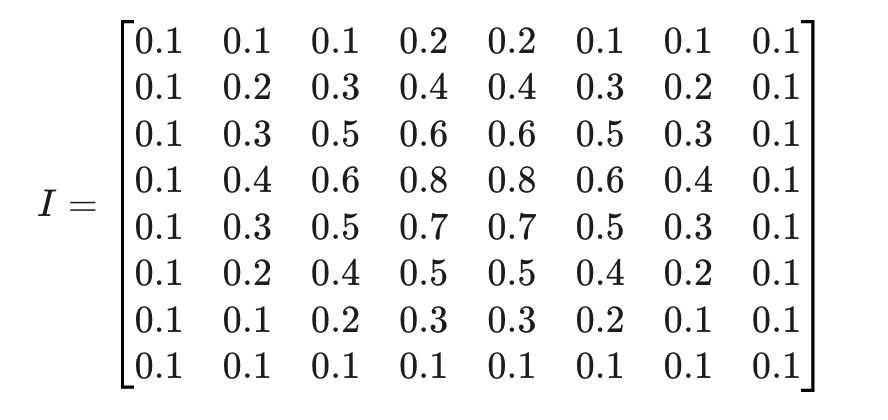

# 从这周开始就开始看西瓜书了

### 对于CNN的具体理解
通过找小猫

1. 输入层操作：
现在给了一张小猫的图片

这是一个已经归一化之后的猫的0-255像素图片，然后现在需要用一个卷积核来对他进行特征的提取，然后就进行到了下一步

2. 然后求第一个提取的特征图

卷积操作的数学公式：

整个的计算流程下来之后，最后会变成这个样子，这个就是求出来了特征图，就是提取出来了最低级的特征

3. 激活函数层
引入relu函数，目的是去除负值，引入非线性，方便去掉不必要的特征

4. 池化层
问题：平移是什么意思？
计算公式：就是找最大值，像卷积核一样放在一个框里面

5. 卷积层2

和上面一样

6. 展平层

变为1v向量

7. 全连接层

偏重

8. 输出层

softmax

9. 。。。

### transformer的理解

正在看[知乎关于transformer的介绍](https://zhuanlan.zhihu.com/p/338817680)

### 西瓜书

前三章快看完了

