# 汇报

### transformer 架构具体解释

#### 大概概念

- 这里没太看懂，所以下面有具体的例子，就从例子入手开始看。

transformer分为两层，分别是 **编码器** 和 **解码器**
编码器负责将输入序列（比如一个句子）编码成连续的向量表示
解码器负责生成输出序列。

自注意力机制：
自注意力机制是能够让句子中的元素通过相关性来加权组合。
查询向量Q：用于查询其他词
键K：用于被查询
值V：包含实际信息

自注意力核心步骤：
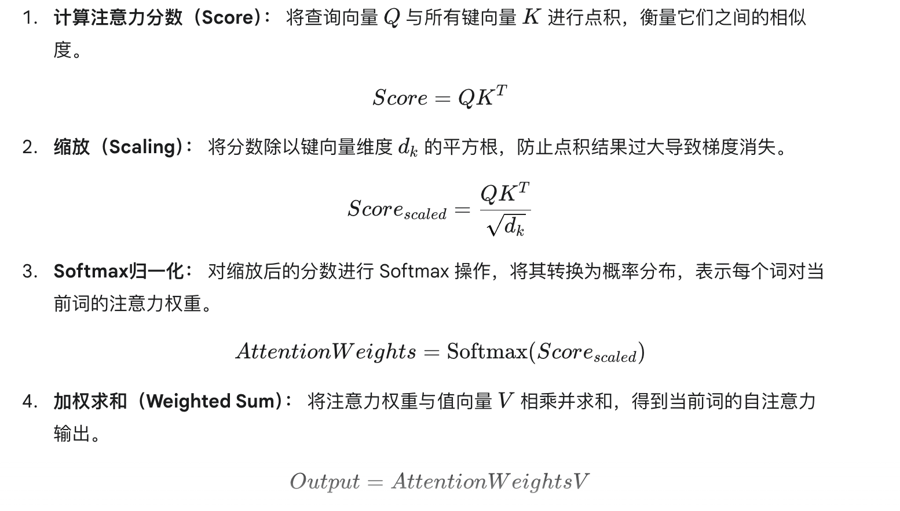
整个过程的公式：
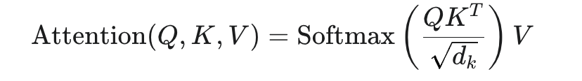

多头自注意力机制：
让模型能够从不同的角度理解信息
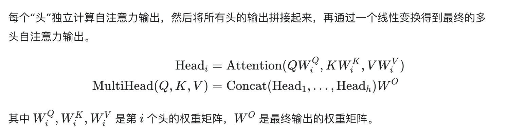
多头自注意力使得模型能够同时关注不同类型的信息，例如，在句子“The quick brown fox jumps over the lazy dog”中，一个头可能关注“fox”和“jumps”之间的动宾关系，而另一个头可能关注“lazy”和“dog”之间的修饰关系。

位置编码：可以区分词的顺序，
在词嵌入中引入位置编码：
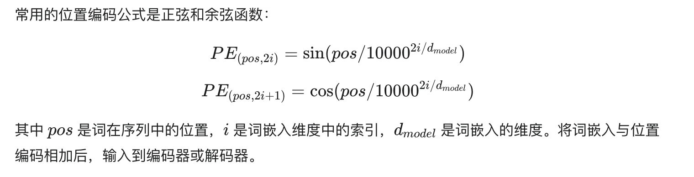

交叉注意力层：
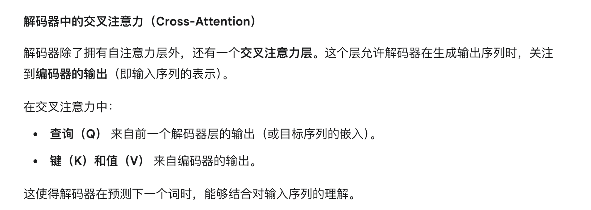

### 具体例子

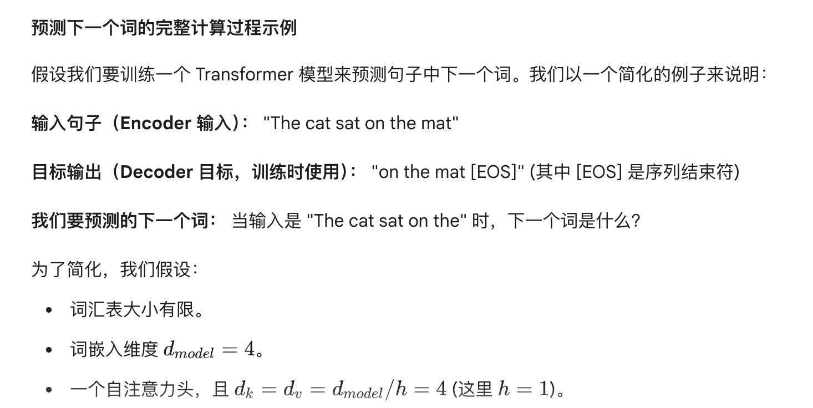
但是这张图片中，存在疑问：

- 词汇表是什么？
- 词嵌入维度是怎么定义的，为什么会对这个有影响？
- 

步骤一：输入编码
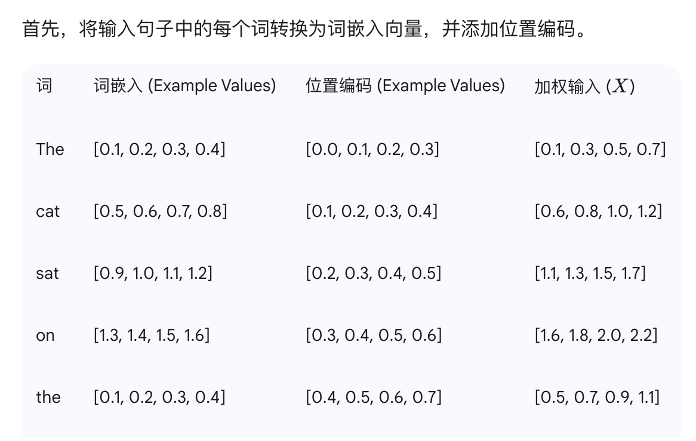

步骤二：编码器-自注意力计算

比如现在已经知道句子是the cat sat on the ___
那么我们以预测到mat为准，所以关注单词on，计算出on的Q向量，以及所有词的K和V向量
假设WQ，WK，WV是随机初始化的权重矩阵，
以下是实例：
（这里不知道什么是随机初始化的权重矩阵）
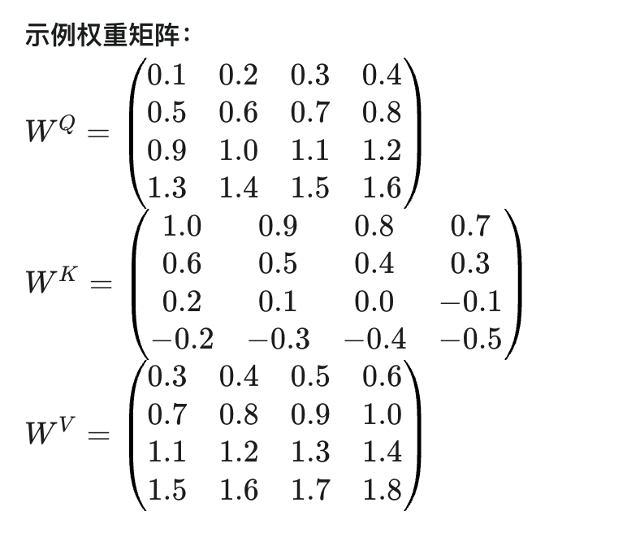
用这个来计算Query,Key,Value向量
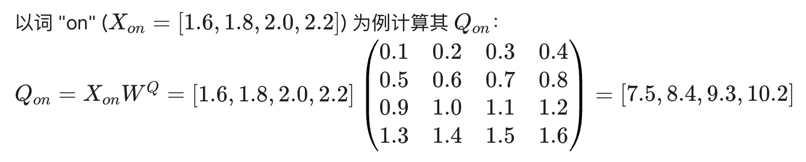
然后继续计算所有词的K，V向量，就像这样：
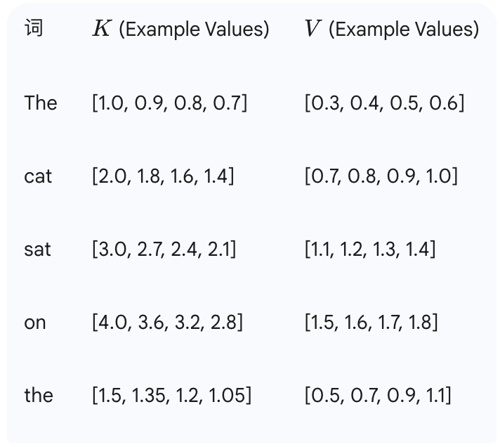
然后计算注意力分数，公式：
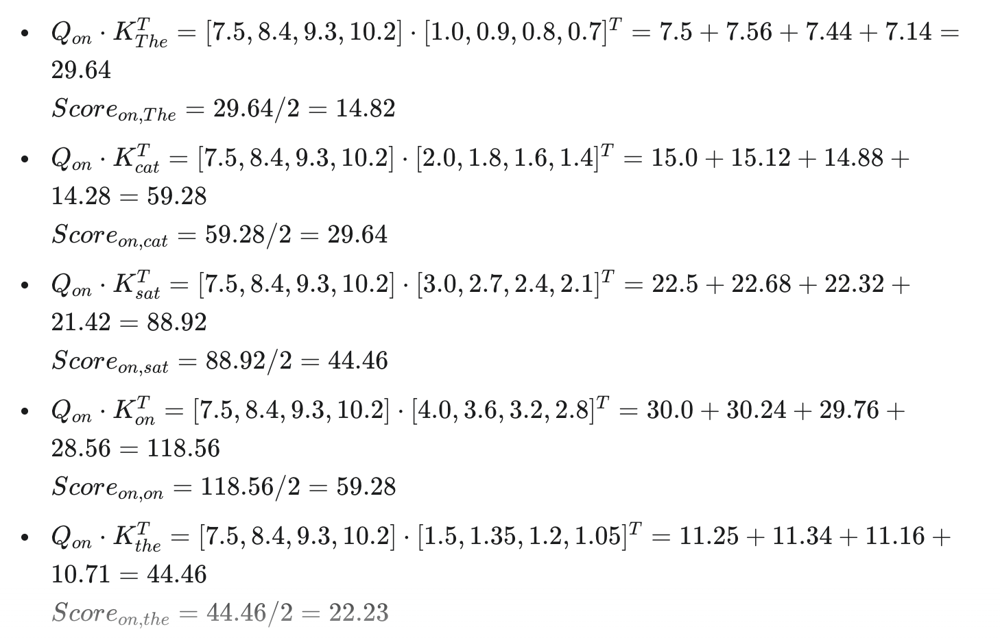
然后进行softmax计算，计算注意力权重：
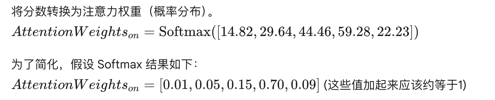
加权求和：
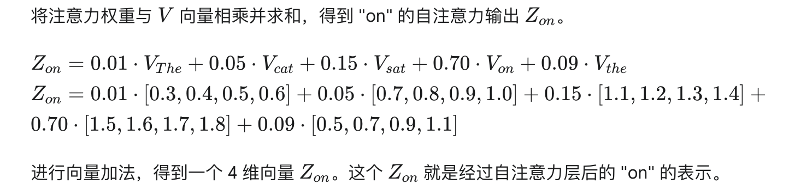

步骤3:解码器

这里就是预测阶段，解码器会逐步生成词语，比如这里，就是给解码器输入
the cat sat on the ___
一些需要注意的点：
- 解码器自注意力（这里需要进一步研究），他是只能注意到已经生成的词，机制和编码器类似
- 解码器交叉注意力：编码器的输出为K和V，解码器的自注意力输出为Q，这能在预测的时候，参考整个句子的信息
- 前馈神经网络：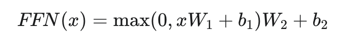，对向量单独处理
- 线性层和softmax层：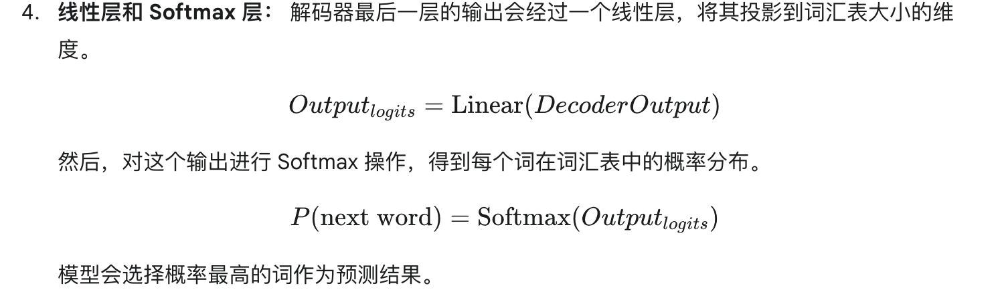

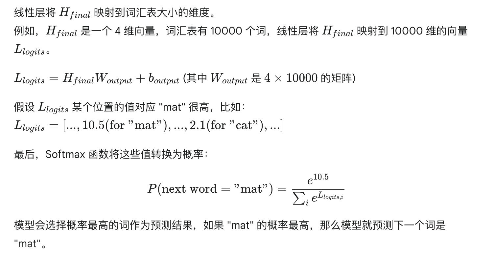

### 然后把上面的步骤重新过了一遍

### 下周

看vision transformer，一些flux，infinity的生图模型，并且跑一下，改一下代码看看效果。

