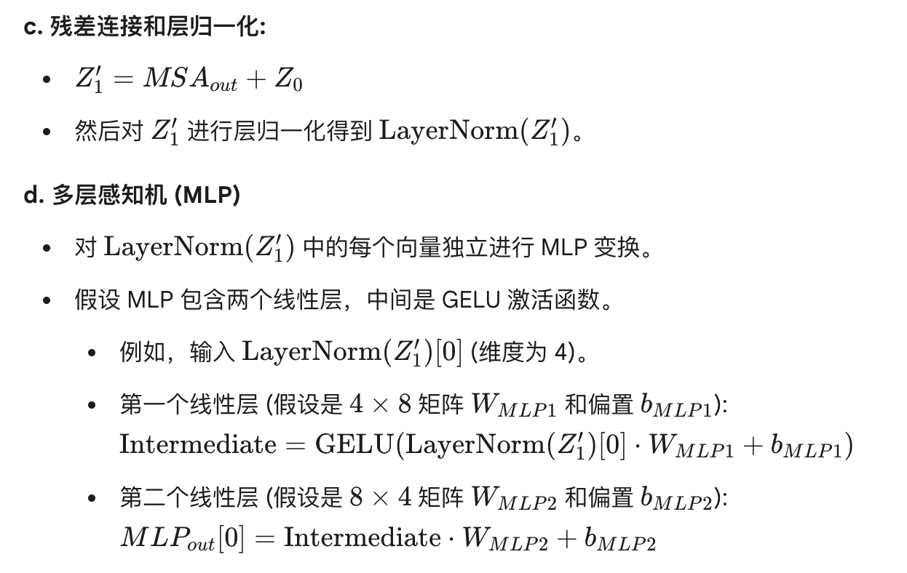

# 读书报告

### vision transformer架构

Vision Transformer (ViT) 的核心思想是将自然语言处理 (NLP) 领域中表现卓越的 Transformer 模型引入到计算机视觉任务中。传统的卷积神经网络 (CNN) 通过卷积操作提取图像的局部特征，而 ViT 则将图像分解成一系列小块（称为 patch），然后像处理文本中的单词一样处理这些图像块。

### 相关概念&相关的原理

1. 图像分块与线性嵌入

2. 位置编码

3. 分类令牌

4. transformer层

5. 分类头

### 具体过程

问题： 这里的参数是怎么设置的？

1. 步骤1，图像分块和线性嵌入

2. 
然后计算其他的z值
3. Transformer解码器（从这里开始就看不太懂了）

计算自注意力分数：

4. 分类头

### 听课
https://www.bilibili.com/video/BV15RDtYqE4r/?spm_id_from=333.337.search-card.all.click&vd_source=457dd738e79ac4e949f25115b0ec0fc9

问ai：
https://g.co/gemini/share/23b7c2e7377e

- 了解了patch embedding是怎么工作的（上面问ai）
- 多层感知机

### 动手学深度学习

多层感知机部分

