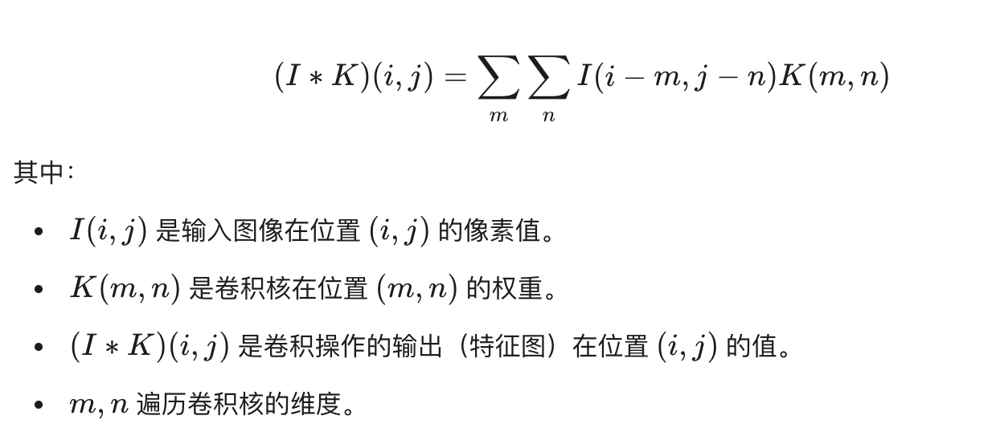
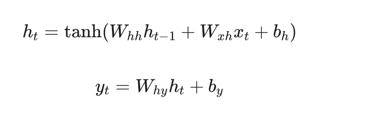

# 读书报告

# 问题

## 为什么在nlp任务中，transformer会更有优势？

总结：长距离依赖和并行计算

### 与RNN等对比
- 按照循环结构处理消息，但是在多次传递之后，会导致梯度消失问题，
比如模型难以理解两个词之间的依赖关系。而transformer抛弃了循环，使用自注意力机制，能够捕捉到长距离依赖。
- 并行计算：由于RNN是需要循环处理（按照顺序处理），所以训练的时间长。

### transformer的优势

编码器：
负责将输入序列变成一个连续的表示（之前写的）
解码器：根据编码器的输出和之前生成的输出
自注意力

### 为什么CNN在图像处理很有优势？

- 图像数据的一个关键特性是其信息通常具有局部相关性。因为特征就是像素块之间的相关性。
卷积操作的公式：

优势：
同一个卷积核在整个图像上滑动（扫描），对所有位置应用相同的权重。这意味着模型学习到的特征检测器可以在图像的任何位置被识别出来。

权值共享：卷积核在不同区域使用相同的权重，就是他在滑动的时候，使用的是相同的卷积核，用来识别特征，就可以避免数据冗余。

### 为什么transformer也能应用到图像处理上？

- transformer自带全局感受野，可以在处理某一个图像块的时候与其他的图像块进行关联，捕捉全局的上下文信息
- 可拓展性：在经过训练后，效果显著提升
- 跨模态泛化能力：经过训练之后，可以弥补一些短板

### 举例对比
RNN:

RNN会破坏其空间结构，因为图像本质上是二维网格数据，而非自然序列。如果强行将图像输入 RNN，通常需要将其展平成一个长长的像素序列。