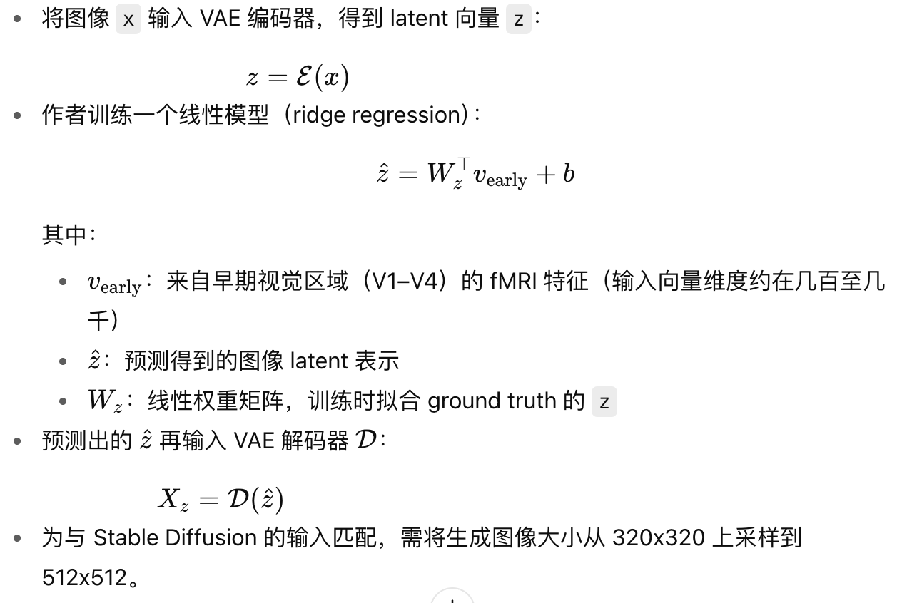

# 汇报

## 读论文

High-resolution image reconstruction with latent diffusion models from human brain activity

### abstract

本文使用一种stable diffusion（LDM潜空间）的方法，来重建脑中的图像

### introduction

1. 背景动机：可以类比人脑与神经网络之间的差异和共性（比如在信息编码层面，抽象层级，语义理解）
2. 挑战：数据不够，需要复杂的模型
3. 使用的技术：latent diffusion model
4. 本文的贡献：用stable diffusion重建图像，从神经科学的角度解释LDM相关的概念

### related work

- 从 fmri重建图像
 1. 使用GAN提升效果
 2. 引入语义标签（之前的那一篇论文）作为辅助输入

- 突破点
 1. 使用LDM来生成图像（不需要重新训练）

- 编码模型
 1. 编码模型：一种预测模型，总结就是可以用来了解模型的某个部分是否对应大脑某个区域的激活值
 2. 作者首次探索生图模型（diffusion models）是否和大脑的区域有关系？因为之前已经有研究表明cnn的每一层和大脑的信息处理有相似的地方

### methods (具体方法)

##### datasets（使用的数据集和处理的方式）

- 使用NSD的fmri数据集
- 本研究分析了4个受试者
- 图像大小为425x425
- 用的数据训练，测试
- fmri经过预处理

##### Latent diffusion（生图模型stable diffusion的结构）

在这里需要深入研究一下，见下文。

##### decoding （从fmri还原图像的过程）

##### encoding（用大脑活动解释LDM的各个部分功能）

### 具体的encoding和decoding步骤

#### decoding方法

作者提出了一个三部曲的方法

步骤1:

步骤2:

步骤3:

#### encoding方法

这儿还是不太懂

