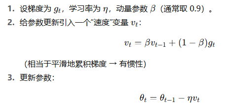
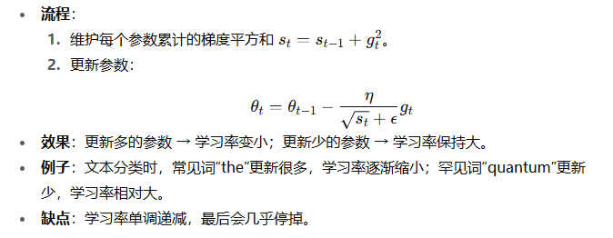
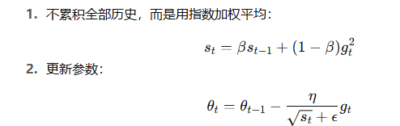
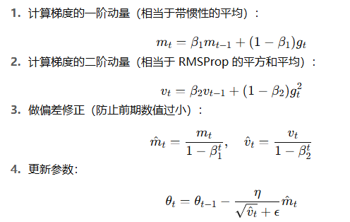

## 动手学深度学习

### 优化算法

- 目的：使得误差最小，使模型在新数据上表现得更好
- 遇到的问题：局部最小值，鞍点，梯度消失

局部最小值：只是在部分的取值范围内是最小值，但是整体来看不是最优解
鞍点：梯度为0，导致后续无法进行求导
梯度消失：趋近于0，难以更新参数

1. 凸型

如果图像是凸型的，那么很快就能判断出最优解

2. 梯度下降

按照梯度的反方向走，直到收敛

3. 随机梯度下降

每次用一个样本计算梯度

4. 小批量梯度下降

每次使用部分样本计算梯度

5. 动量法

考虑历史梯度的惯性，更新更快更平稳

不断地增大/减小梯度

6. adagrad

对不同参数使用不同的学习率，更新多的参数学习率小

7. rmsprop

改进的adagrad，保留近期梯度平方的加权平均，避免学习率衰减太快

8. adadelta

去掉学习率，用梯度自身的尺度做自适应调整

9. adam

同时考虑动量和自适应学习率

10. 学习率调度器

动态调整学习率
